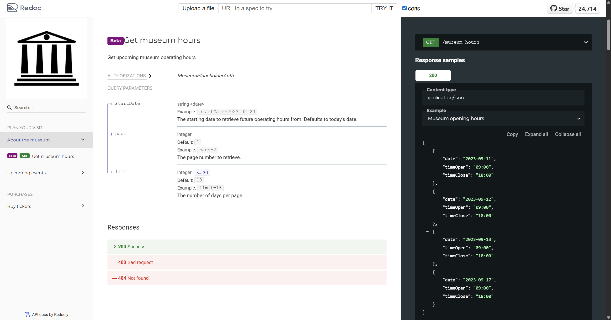

---

# 🔍 SwaggerPathFilter

**SwaggerPathFilter** is a simple CLI tool that lets you **filter only the desired endpoints from a Swagger JSON file** and generate clean, focused API documentation using **ReDoc**.



---

## 🚀 Step 1: Export `swagger.json` from Your API

If you're using **Swagger UI** or **Swashbuckle**, you can get your Swagger definition by navigating to:

```
https://<your-api-domain>/swagger/v1/swagger.json
```

> 💡 Right-click the page and choose **"Save As"** to download the file.

---

## 🛠 Step 2: Filter Endpoints with `SwaggerPathFilter`

1. **Download and unzip the CLI tool**:

   👉 [Download ReadyToRun Build](ReadyToRun/Build.zip)

2. **Create a plain text file** (e.g., `endpoints.txt`) with each desired path on a new line:

   ```txt
   /api/Account/Token
   /api/incidents/analytics/reports/types
   ```

3. **Run the tool**:

   ```bash
   SwaggerPathFilter.exe endpoints.txt swagger.json filtered_swagger.json
   ```

   ✅ This will generate a new `filtered_swagger.json` file containing only the specified paths.

---

## 🌐 Step 3: Generate Beautiful Docs with ReDoc CLI

1. **Install ReDoc CLI**:

   ```bash
   npm install -g redoc-cli
   ```

2. **Generate the HTML documentation**:

   ```bash
   redoc-cli bundle filtered_swagger.json -o docs.html
   ```

3. **Open `docs.html` in your browser** and enjoy your clean, focused API documentation!

---